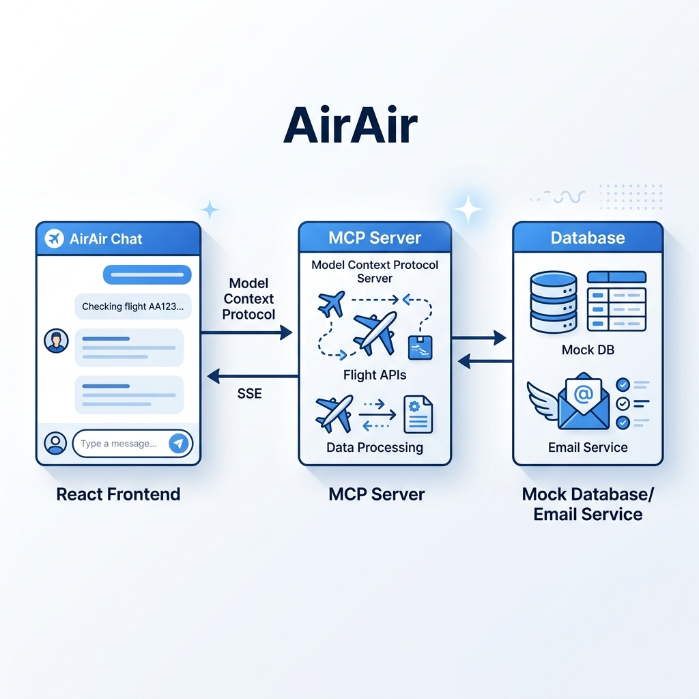

# AirAir: Agentic MCP Flight Booking Assistant

AirAir is a state-of-the-art flight search and booking application built on the **Model Context Protocol (MCP)**. It features a chat-first, agentic interface where a conversational AI assistant handles the entire flight lifecycle—from searching to booking and emailing tickets.

## 🚀 Overview

The application is designed to demonstrate the power of decoupled AI tools. The frontend acts as an MCP Host, while the backend serves as a dedicated MCP Server providing flight-related capabilities.

### Key Features
- **Conversational Booking**: Search and book flights using natural language.
- **Interactive Flight Cards**: Select flights directly from the chat stream.
- **Email Ticketing**: Automated ticket simulation sent to the user's email.
- **Premium Design**: Glassmorphic UI, Inter/Outfit typography, and a modern agentic dashboard.
  [](https://youtu.be/MPU4Mxg5Syo)

---

## 🏗️ Architecture

The app uses a layered MCP architecture with SSE (Server-Sent Events) for real-time tool execution.

### High-Level Diagram

```mermaid
graph TD
    subgraph "Frontend (Client)"
        UI[React UI]
        Agent[Agentic Logic]
        MCPClient[MCP Client SDK]
        UI --> Agent
        Agent --> MCPClient
    </div>

    subgraph "Backend (MCP Server)"
        MCPServer[MCP Server SDK]
        Tools[Flight Tools]
        DB[(Mock Flight DB)]
        Email[Email Service]
        MCPServer --> Tools
        Tools --> DB
        Tools --> Email
    </div>

    MCPClient <== "SSE" ==> MCPServer
```



---

## 🤖 The App Creation Prompt

You can use the following prompt to recreate this application or build similar agentic MCP experiences:

```text
Build a premium, full-stack flight search and booking application using the Model Context Protocol (MCP). The application must feature an "Agentic Chat-First" interface where the primary interaction occurs through a conversational AI assistant that uses MCP tools to perform actions.

### 1. ARCHITECTURE REQUIREMENTS
- Use MCP Server (Backend) and MCP Client (Frontend).
- Communication: SSE (Server-Sent Events) with multi-session support (Server-per-connection).
- Stability: Avoid global JSON body-parsing on SSE routes to prevent stream consumption issues.

### 2. BACKEND TOOLS
- search_flights(from, to): Filters a mock flight database.
- book_flight(flightId, passengerName, email): Confirms booking and simulates an email ticket.

### 3. FRONTEND & UI
- Design: Modern, "Airy" aesthetics, glassmorphism, Inter/Outfit fonts.
- Agent Logic: Conversational flow with interactive flight selection cards inside the chat.
- Sidebar: Real-time booking summary dashboard.
```

---

## 🛠️ Technical Details

### Backend
- **Node.js/Express**: Using `@modelcontextprotocol/sdk`.
- **Session Isolation**: Each user gets a private MCP Server instance for maximum stability.
- **Port**: 3001

### Frontend
- **Vite/React**: Using the MCP Client SDK for browser-to-server tool calls.
- **Lucide Icons**: Premium iconography for the agent and flight actions.
- **Port**: 5173/5174

---

## 📋 How to Run

1. **Start MCP Server**:
   ```bash
   cd mcp-server
   npm install
   npm start
   ```

2. **Start Client**:
   ```bash
   cd client
   npm install
   npm run dev
   ```

3. **Interact**: Open the local URL and tell the agent: *"Find flights from London to Dubai"*.
